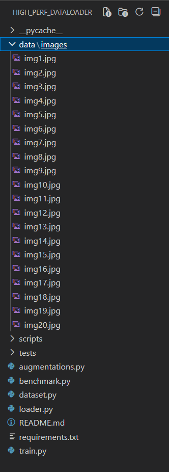
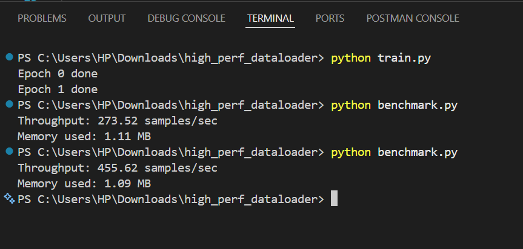
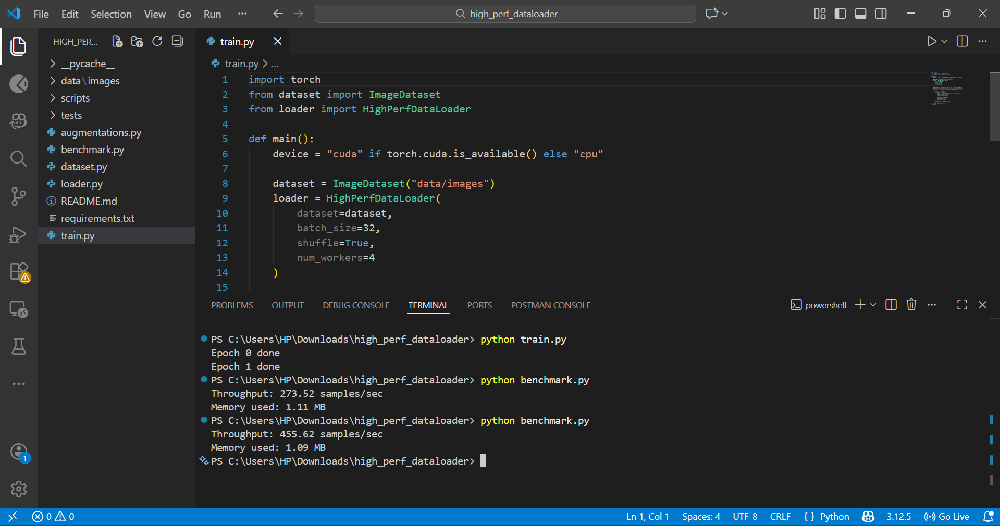
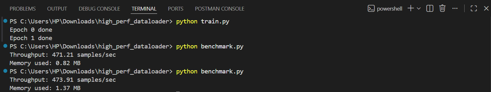

## 🚀 High-performance Data Loader for Custom Dataset

This project implements a **high-performance custom data loading pipeline** using **PyTorch** to efficiently handle large-scale image datasets.  
The goal is to improve training performance by reducing data-loading bottlenecks through **parallelism, prefetching, and caching**.

The solution is designed to be **scalable, modular, and efficient**, making it suitable for deep learning workloads that require fast and reliable batch loading.

---

## 🧠 Key Features

- Custom PyTorch Dataset and DataLoader
- Asynchronous data prefetching to overlap data loading with training
- Multi-worker parallel data loading using PyTorch workers
- In-memory caching to avoid repeated disk reads
- Custom data augmentations applied during loading
- Benchmarking support for throughput and memory usage
- Example training loop demonstrating real-world usage

---

## 🛠️ Technologies Used

- Python 3  
- PyTorch  
- NumPy  
- pytest – for sanity checks and testing  
- Git – version control  

---

## ⚙️ How It Works

### Dataset Class
- Loads images from disk  
- Applies transformations and augmentations  
- Supports optional caching for faster reuse  

### High-performance DataLoader
- Uses multiple workers for parallel loading  
- Prefetches batches asynchronously  
- Reduces GPU idle time during training  

### Benchmarking
- Measures samples processed per second  
- Tracks memory usage  
- Helps evaluate performance improvements  

---

## 📊 Benchmark Results

The benchmarking script reports:
- Throughput (samples/sec)
- Memory consumption
- Comparison between cached and non-cached loading

These metrics help validate the efficiency of the custom data loader.

---
## 📸 Screenshots

### Project structure

### Executioncommands

### Project Interphase

### Project Results

---

## 🧪 Testing

Basic sanity tests are included to verify:
- Dataset loading correctness
- Batch size consistency
- Stability of the DataLoader pipeline

---

## 📌 Conclusion

This project demonstrates how optimized data loading techniques can significantly improve deep learning training performance. By combining PyTorch’s parallelism with custom optimizations, the data pipeline becomes faster, scalable, and production-ready.

